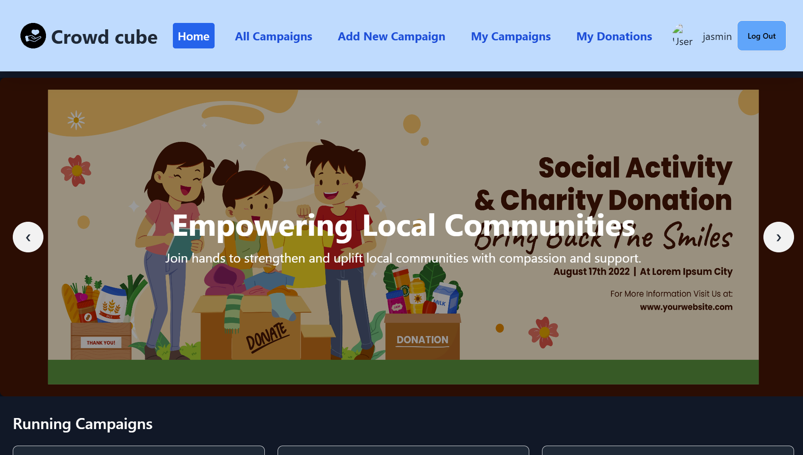

# Crowd Cube

[Live Site URL](https://rococo-zabaione-06675f.netlify.app/)

## Project Overview

<!--  -->


## Features
1. **Campaign Creation**: Easily create campaigns with custom titles, descriptions, donation goals, and deadlines.
2. **Update Campaigns**: Edit your campaigns with real-time updates to ensure accuracy.
3. **Responsive Design**: Fully responsive UI, ensuring a seamless experience on all devices.
4. **Secure Authentication**: Integrated with Firebase for secure user login and authentication.
5. **User Dashboard**: Manage and view your campaigns conveniently from a personalized dashboard.

## Technologies Used
- React.js
- Tailwind CSS
- Firebase Authentication
- Vercel Deployment
- REST API

## Dependencies
- React Router
- Firebase SDK
- Axios (for API requests)
- React Hook Form (for form handling)

## How to Run Locally
1. Clone this repository:
   ```bash
   git clone https://github.com/programming-hero-web-course2/b10-a10-client-side-jasminaramim
   ```
2. Navigate to the project directory:
   ```bash
   cd b10-a10-client-side-jasminaramim
   ```
3. Install dependencies:
   ```bash
   npm install
   ```
4. Create a `.env` file in the root directory and add your Firebase credentials:
   ```bash
   REACT_APP_FIREBASE_API_KEY=your_api_key
   REACT_APP_FIREBASE_AUTH_DOMAIN=your_auth_domain
   ```
5. Start the development server:
   ```bash
   npm run dev
   ```
6. Open [http://localhost:5173](http://localhost:5173) in your browser.

## Relevant Links
- [Live Site](https://rococo-zabaione-06675f.netlify.app/)
- [GitHub Repository]([https://github.com/programming-hero-web-course2/b10-a10-client-side-jasminaramim](https://github.com/jasminaramim/Crowd-cube))
- [Firebase Documentation](https://firebase.google.com/docs)

